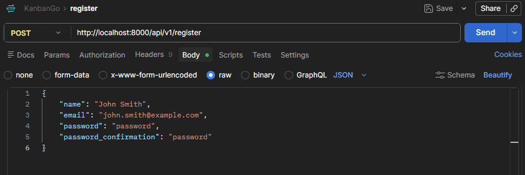
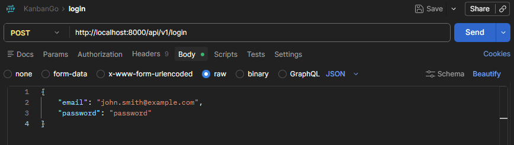
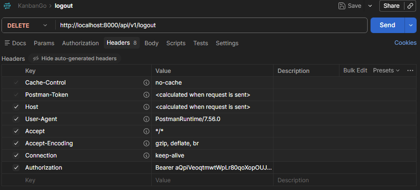

<a id="readme-top"></a>
<!-- PROJECT SHIELDS -->
<!--
*** I'm using markdown "reference style" links for readability.
*** Reference links are enclosed in brackets [ ] instead of parentheses ( ).
*** See the bottom of this document for the declaration of the reference variables
*** https://www.markdownguide.org/basic-syntax/#reference-style-links
-->

<!-- PROJECT LOGO -->
<br />
<div align="center">
<h1 align="center">KanbanGo (Backend)</h1>

  <p align="center">
    Project and task management application with collaborative features.
    <br />
  </p>
</div>

<!-- TABLE OF CONTENTS -->
<details>
  <summary>Table of Contents</summary>
  <ol>
    <li>
      <a href="#about-the-project">About The Project</a>
      <ul>
        <li><a href="#built-with">Built With</a></li>
      </ul>
    </li>
    <li>
      <a href="#getting-started">Getting Started</a>
      <ul>
        <li><a href="#prerequisites">Prerequisites</a></li>
        <li><a href="#installation">Installation</a></li>
      </ul>
    </li>
    <li><a href="#usage">Usage</a></li>
    <li><a href="#roadmap">Roadmap</a></li>
    <li><a href="#acknowledgments">Acknowledgments</a></li>
  </ol>
</details>

<!-- ABOUT THE PROJECT -->

## About The Project

This is the backend part of my full stack project KanbanGo. It is an application for managing projects boards and tasks on them, with the additional option of working in collaboration with other board members.
I started this project because I wanted to go through the full process of building everything myself, in this part I'm attempting to create clean RESTful APIs that I can then connect to the frontend.

<p align="right">(<a href="#readme-top">back to top</a>)</p>

### Built With

- [![Laravel][Laravel.com]][Laravel-url]
- [![Postman][Postman.com]][Postman-url]

<p align="right">(<a href="#readme-top">back to top</a>)</p>

<!-- GETTING STARTED -->

## Getting Started

Here you find the instructions on how to set up the project locally.

### Prerequisites

Make sure you have the following installed:

- [Laravel 13](https://laravel.com/docs/13.x/installation)

### Installation

1. Clone the repo (or download the project as a zip file)
   ```sh
   git clone https://github.com/alexS317/kanbango-backend.git
   cd kanbango-backend
   ```
2. Install composer dependencies
   ```sh
   composer install
   ```
3. Copy the .env.example file and generate an application key
   ```sh
   php artisan key:generate
   ```
4. Configure your local .env file (database, mail, etc.)
   
5. Run migrations
   ```sh
   php artisan migrate
   ```
6. Start the development server
   ```sh
   php artisan serve
   ```

<p align="right">(<a href="#readme-top">back to top</a>)</p>

<!-- USAGE EXAMPLES -->

## Usage

The project is a pure backend API and none of the frontend features included in Laravel (such as Blade templates) are used here. To test the API endpoints, a tool like Postman can be used. In this way you can for example register (which will at the current state of the project also log the user in at the same time), log in, or log out (for this step you have to copy the access token received during register/login and add it to the authorization header):

<div align="center">
  
  
  
</div>

You can also seed the database to generate some pre-made entries to play around with. The following command will per default generate 5 users who may own one or more boards, and randomly assign them as members on other boards as well:
```sh
   php artisan db:seed
```

<p align="right">(<a href="#readme-top">back to top</a>)</p>

<!-- ROADMAP -->

## Roadmap

- [x] Add basic user authentication
- [x] Create/edit/delete boards
  - [x] Implement customizable board categories
- [ ] Create/edit/delete tasks
- [ ] Add collaboration features
  - [x] Invite users to boards via email
  - [x] Manage member roles
  - [ ] Implement notifications (task assignment, status change of assigned task, etc.)
- [ ] Improve authentication (email verification when signing up, password resetting)
- [ ] Add extra user profile customisation features (profile picture etc.)

<p align="right">(<a href="#readme-top">back to top</a>)</p>

<!-- ACKNOWLEDGMENTS -->

## Acknowledgments

- Based on [Best README Template](https://github.com/othneildrew/Best-README-Template)

<p align="right">(<a href="#readme-top">back to top</a>)</p>

<!-- MARKDOWN LINKS & IMAGES -->
<!-- https://www.markdownguide.org/basic-syntax/#reference-style-links -->


<!-- Shields.io badges. You can a comprehensive list with many more badges at: https://github.com/inttter/md-badges -->

[Laravel.com]: https://img.shields.io/badge/Laravel-FF2D20?style=for-the-badge&logo=laravel&logoColor=white
[Laravel-url]: https://laravel.com/
[Postman.com]: https://img.shields.io/badge/Postman-FF6C37?style=for-the-badge&logo=postman&logoColor=white
[Postman-url]: https://www.postman.com/
